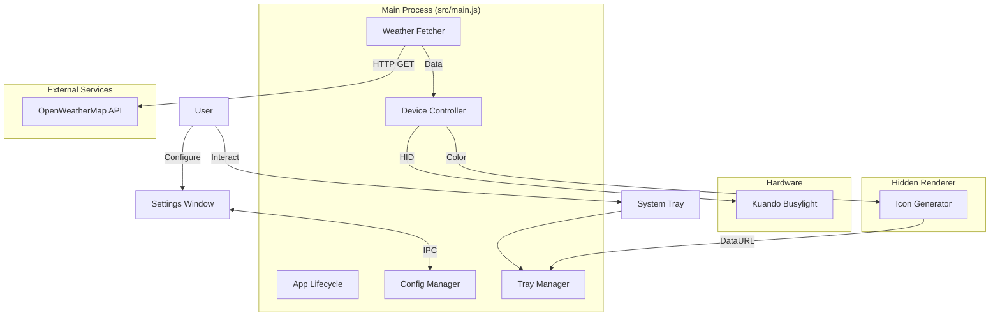

# Architecture Documentation

## Overview
WeatherLight is an Electron application that bridges OpenWeatherMap API data with physical hardware (Kuando Busylight) to provide ambient weather visualization. The application runs in the system tray and polls for weather updates.

## Architecture

## Key Components

### 1. Main Process (`src/main.js`)
The central orchestrator of the application.
- **Responsibility**: 
    - Manages application lifecycle.
    - Handles system tray interactions.
    - Periodically fetches weather data.
    - Controls the Busylight device via `node-hid`.
    - Manages configuration persistence.
- **Dependencies**: `electron`, `axios`, `node-hid`, `fs`, `path`.

### 2. Configuration (`config.json`)
Stored in the user's data directory (`app.getPath('userData')`).
- **Fields**:
    - `apiKey`: OpenWeatherMap API Key.
    - `location`: User's city/location.
    - `pulse`: Boolean to enable/disable precipitation pulsing.
    - `pulseSpeed`: Speed of the pulse animation.
    - `sunsetSunrise`: Boolean to disable light at night.

### 3. Weather Logic
- **Polling**: Updates every 15 minutes.
- **Flow**:
    1. **Geocode**: Convert location string to Lat/Lon.
    2. **Current Weather**: Get sunrise/sunset times.
    3. **Forecast**: Get 5-day/3-hour forecast to predict immediate weather.
    4. **Logic**:
        - `Temperature` determines base color (Blue -> Red).
        - `Precipitation` (Rain/Snow) triggers pulsing effect.

### 4. Hardware Integration
- **Library**: Custom wrapper around `node-hid` (located in `lib/`).
- **Control**: Sends HEX byte arrays to the device to set RGB values and pulse settings.

### 5. Hidden Renderer (`src/icon_generator.html`)
- **Purpose**: Dynamically generates tray icons based on the current weather color.
- **Mechanism**: Canvas manipulation -> `toDataURL()` -> sent to Main Process via IPC.

## Data Flow
1. **Startup**: App loads config, initializes Tray, and connects to Busylight.
2. **Loop**: `setInterval` triggers `fetchWeather()` every 15m.
3. **Fetch**: `axios` retrieves weather data.
4. **Process**: Data is parsed to determine `Color` and `Pulse` state.
5. **Update Device**: `busylight.write()` sends command.
6. **Update UI**: `tray.setToolTip()` and `tray.setImage()` updated.

## Invariants & Assumptions
- **Hardware**: Assumes a single Kuando Busylight device is connected.
- **Network**: Assumes active internet connection for API access.
- **API Key**: User must provide a valid key; otherwise, the app idles/alerts via Tray tooltip.

## Debugging
- **Logs**: The application logs extensively to `console.log` (stdout) and `console.error` (stderr). Run from terminal to view.
- **Common Issues**: 
    - `node-hid` failures (missing dependencies or permissions).
    - API Rate limiting (OpenWeatherMap free tier).
    - Invalid Location strings.
