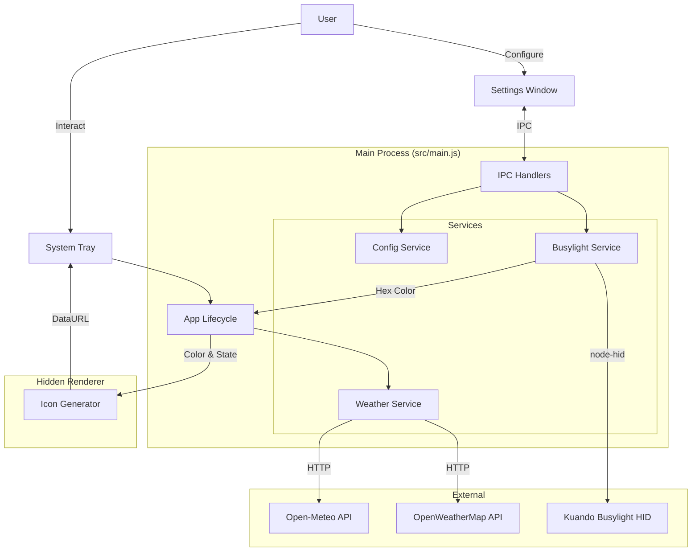

# Architecture Documentation

## Overview
**WeatherLight** is an Electron application that creates an ambient weather visualization using a **Kuando Busylight**. It runs in the system tray, fetching local weather data and translating it into meaningful light colors and animations (e.g., pulsing for rain).

## System Design

The application follows a **Modular Monolith** pattern within the Electron Main Process, separating concerns into distinct services while keeping the deployment simple.

## Key Components

### 1. Main Entry (`src/main.js`)
The central coordinator.
- **Lifecycle**: handles `app.on('ready')`, tray creation, and window management.
- **Loop**: Sets up the 15-minute weather fetch interval.
- **Coordination**: Fetches weather from `WeatherService`, passes it to `BusylightService`, and updates the Tray tooltip/icon.
- **IPC Handlers**:
    - `get-settings` / `set-settings`: Config management.
    - `get-weather-state`: Returns last fetched weather.
    - `detect-location`: **(New)** Triggers immediate IP-based location detection.
    - `validate-location`: Checks if a city/country string is valid.
    - `get-device-info` / `set-manual-mode` / `apply-manual-state`: Diagnostics.

### 2. Services (`src/services/`)
- **`config-service.js`**: Manages `config.json` in the User Data directory. Stores API keys, location, units (C/F), and preferences.
- **`weather-service.js`**: 
    - Abstracts provider differences (Open-Meteo vs. OpenWeatherMap).
    - Handles **Auto-Location** via IP-API.
    - Centralizes logic: Calculates `isNight` state based on sunrise/sunset.
    - Returns a unified `WeatherState` object.
- **`busylight-service.js`**:
    - Wraps `node-hid` interactions via `lib/`.
    - Maps Temperature -> Color (using `src/color-scale.js`).
    - Handles **Pulse Animations** (Gamma bypass for smoothness).
    - Manages **Diagnostics Mode** (manual override).

### 3. UI Windows (`src/settings.html`, `src/icon_generator.html`)
- **Settings Window**: 
    - Dynamic height resizing based on selected provider.
    - **Diagnostics Mode**: A hidden view for testing hardware LEDs and animations.
    - **Context Isolation**: Uses `preload.js` to securely expose Main Process API (`window.api`).
- **Icon Generator**:
    - A hidden, non-visible window.
    - Uses HTML5 Canvas to draw the dynamic tray icon.
    - Features: Rounded corners, Night mode "stars" overlay.

## Data Flow

1.  **Initialization**: App loads config, connects to Busylight.
2.  **Weather Fetch**: 
    - `WeatherService` gets location (Auto or Config).
    - Fetches data from Provider.
    - Calculates `isNight`.
3.  **Update Cycle**:
    - `Main` receives weather data.
    - **Tray**: Tooltip updated (Unit-aware: C/F).
    - **Hardware**: `BusylightService` determines color/pulse.
        - If `isNight` & `SunsetMode=True`: Turn off.
        - Else: Apply color/pulse.
    - **Icon**: Color sent to `IconGen` -> rendered -> sent back to `Main` -> set as Tray Icon.
4. **Auto-Detect Preview**:
    - User checks "Auto-detect" in Settings.
    - Renderer calls `detect-location`.
    - Service queries IP-API.
    - Result (City, Country) is returned and displayed immediately in the input field.

## Refactoring Notes / Code Standards

-   **Context Isolation**: All renderers must use `contextIsolation: true`. No direct Node.js access in UI.
-   **Service Pattern**: Logic resides in `src/services/`, not `main.js` or UI files.
-   **Async/Await**: Used consistently for all I/O.
-   **Error Handling**: Services must not crash the app; they log errors and return safe fallbacks (e.g., white light, error tooltip).

## Debugging

-   **Logs**: `console.log` in Main Process outputs to terminal.
-   **Diagnostics**: Use the in-app "Diagnostics Mode" to isolate hardware issues vs. weather data issues.
-   **Config**: Located at `%APPDATA%\WeatherLight\config.json`.
