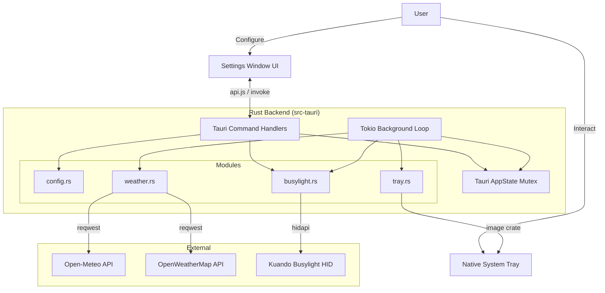

# Architecture Documentation

## Overview
**WeatherLight** is a native ambient weather visualization tool that interfaces with a **Kuando Busylight**. Rewritten from Electron to **Tauri**, it significantly reduces memory footprint and bundle size (~67MB down to ~6MB) while retaining its exact frontend design. It runs natively in the system tray, fetching local weather data and translating it into light patterns and colors.

## System Design

The application follows a **Shared State Concurrency** pattern built on top of Rust's `Arc<Mutex<T>>`.

## Key Components

### 1. `lib.rs` (The Orchestrator)
The central initialization layer.
- **Lifecycle**: Sets up the Tauri application builder, registers plugins (autostart, single-instance). Intercepts `RunEvent::ExitRequested` to keep the app alive silently in the background when windows are closed.
- **Background Loop**: Spawns an async `Tokio` thread that executes immediately (`first_run` flag) and then queries the `weather_svc` every 15 minutes, pushing results into the `AppState`, the `Tray`, and the `Busylight` controller.
- **State Management**: Hosts the `AppState` struct (Mutex-wrapped configuration, hardware controllers). Gracefully handles missing `hidapi` hardware without panicking.
- **IPC Interface**: Exposes `#[tauri::command]` functions connected to the frontend (`get_settings`, `apply_manual_state`, `detect_location`, etc).

### 2. `busylight.rs` (Hardware Abstraction)
- Wraps the `hidapi` crate to execute low-level byte array transmissions to the USB interface.
- Includes a dedicated pulsing thread tracking a shared `PulseState` inside an `Arc<Mutex>`, avoiding blocking the main event loops during soft continuous lighting animations.

### 3. `weather.rs` (Network Logic)
- Built around the `reqwest` crate pointing to Open-Meteo or OpenWeatherMap endpoints.
- Calculates sunrise/sunset locally using geometry, establishing the `isNight` flag.
- Normalizes data into a generic `WeatherState` struct compatible with both APIs.

### 4. `tray.rs` (Dynamic Icon & Autostart)
- Since Tauri does not easily support headless WebViews for `<canvas>` generation, the dynamic tray icon is algorithmically drawn using the Rust `image` crate.
- `update_tray_icon`: Manipulates RGBA buffers to draw solid or night-dimmed circular vectors based directly on the provided weather Hex color.
- **Menu Behavior**: Controls the OS Autostart registry. Modifying the Autostart checkbox clones the active state, updates `$APPDATA/config.json`, and updates the registry simultaneously to prevent desynchronization upon reboot. To explicitly kill the application, the Tray `Quit` button invokes a hard `std::process::exit(0)` bypass route.

### 5. `config.rs`
- Strict typing of the application settings using `serde`.
- Reads and writes to the system's AppData (`$APPDATA/WeatherLight/config.json`).
- Handles alias mapping for JavaScript configuration variables (e.g., `#[serde(rename = "autoLocation")]`).

## Data Flow

1.  **Initialization**: Tauri `setup()` hook runs, loading settings and seeding the `AppState`.
2.  **Weather Fetch Interval**: The `Tokio` loop ticks every 15 minutes.
    - Determines which API provider to hit (Open-Meteo / OWM).
    - Dispatches async GET request.
3.  **Update Cycle**:
    - Generates string tooltip based on current temperature bounds and units (`C / F`).
    - Pushes tooltip to `tray.rs`.
    - Generates color hex map (`#FF0000`, etc). Draws the tray image byte vector and flushes it to the OS.
    - Triggers the `BusylightController` (unless diagnostic manual mode is enabled).
4. **Auto-Detect Process**:
    - Clicking the detect location link invokes `detect_location`.
    - Backend queries `http://ip-api.com/json` and returns the structured `LocationDetectResult` straight into the UI bindings.

## Build Pipeline

The shift to Tauri leverages Rust's native compilation target:
- **Command**: `npm run tauri build` or `cargo tauri build`.
- Generates a standalone MSI or NSIS `.exe` installer.
- Release target includes aggressive size optimization options in `Cargo.toml`. Instead of packaging an entire Chromium instance, it relies on the host OS Webview system (WebView2 on Windows). Size is heavily reduced from \~67MB to just **~6MB**.
